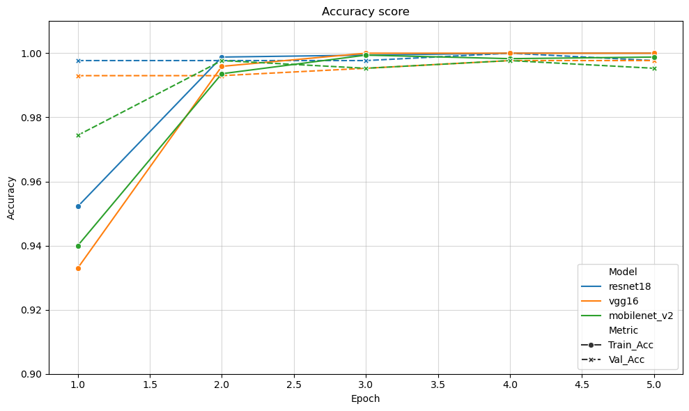

# Deep-Learning Methods Benchmarking with Multi-Class Plankton Image Data

**[IM20500231] Information Technology Fundamental Part I - Introduction to Materials Data Science**

> C4IM2508 Jaronchai Dilokkalayakul  
> C4IM2501 Daffa Akbar Aprilio  
> C5IM2015 Ganchimeg Namuunbayar  

## Introduction

**Objectives**: To benchmark and compare the performance of various deep learning models, including Convolutional Neural Networks (CNNs) and Graph Convolutional Networks (GCNs), on plankton classification tasks.

**Goals**: Identify the most effective architecture for accurately classifying plankton species.

## EDA, Data Cleaning and Data Preparation

### Obtaining data for benchmarking

Strategy:

- Choosing 4 classes from the raw data folder:
- Represents a genus (no mixing, no non-plankton image, etc.)
- Every class contains similar amount of files

### Plankton classes to use in benchmarking

- Dinobryon
- Pseudonitzschia
- Dactyliosolen
- Corethron

### Exploratory data analysis

### Data preparation for modeling

| Techniques | Description |
| :-------- | :-------- |
| Resize | Ensure fixed input size for model (e.g., 224×224) |
| Normalize | Scale pixel values to [0, 1] or [-1, 1] |
| Augmentation | Improve generalization and prevent overfitting |
| Train-test split | Evaluate properly on unseen data |

## Deep Learning Modelings

1. Convolutional Neural Network
2. Unsupervised Learning
3. Graph Network

## Convolutional Neural Network

### Model Training for CNN

We are comparing the accuracy of 3 CNN models:
1. ResNet18
2. VGG16
3. MobileNetV2

### Model Evaluation for CNN

At epoch 2, all 3 models reach a considerably similar accuracy (~0.99)

## Unsupervised Learning

### Model Training for Unsupervised

We are combining deep learning-based feature extraction with classical unsupervised clustering to group images of species without using labeled data for training.

The method involves:

1. Using a pretrained CNN to extract high-level feature vectors from images.
2. Applying KMeans clustering to group similar feature vectors.
3. Evaluating the clusters by comparing them to true species labels using metrics like ARI.

### Clustering Visualization

### Adjusted Rand Index (ARI)

- Clusters align well with the actual species classes, better than what would happen by chance.
- This suggests that the feature extractor is capturing meaningful structure in the images.
- However, it’s not perfect — some species are likely grouped together, possibly due to visual similarity or noise.

Why this works?

- CNN feature embeddings separate visual patterns, Pretrained CNNs learn to detect hierarchical patterns — edges, textures, and object shapes — which generalize across domains.
- Feature vectors from the last convolutional layer are semantically meaningful, these 512D vectors summarize key visual content and allow algorithms like KMeans to group similar-looking species.
- Clustering reflects real visual similarity, KMeans groups together embeddings that are close in high-dimensional space, which translates to similar visual features in practice.

## Graph Network

### Data Preprocessing for Graph

### Model Training for Graph

### Model Evaluation for Graph

## Benchmarkings

## Summary
