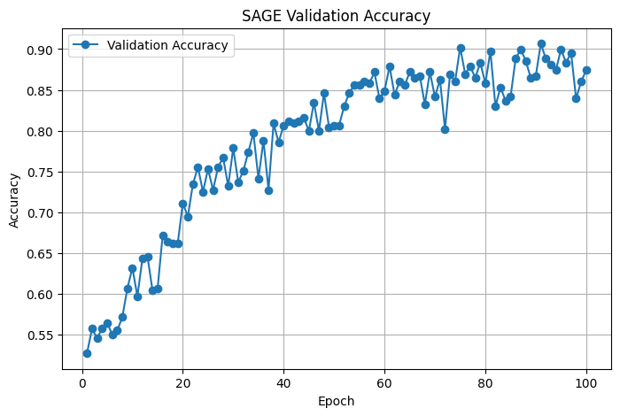
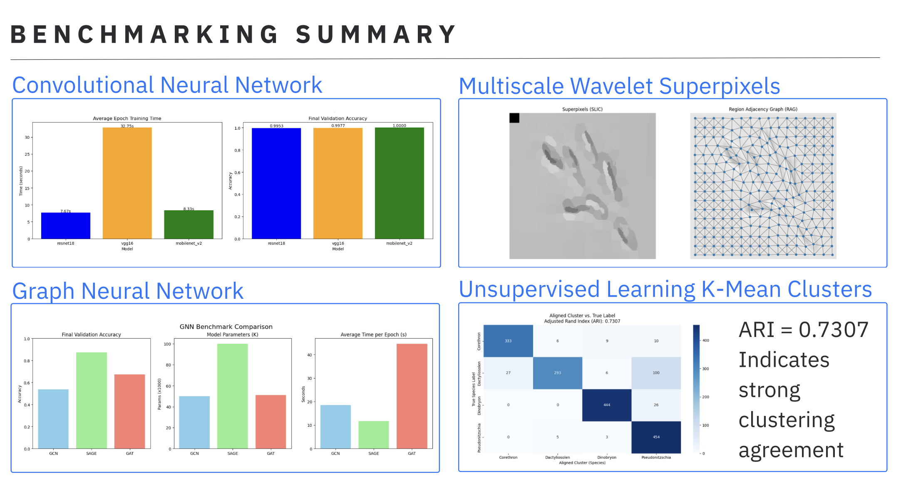

# Deep-Learning Methods Benchmarking with Multi-Class Plankton Image Data

**[IM20500231] Information Technology Fundamental Part I - Introduction to Materials Data Science**

> C4IM2508 Jaronchai Dilokkalayakul  
> C4IM2501 Daffa Akbar Aprilio  
> C5IM2015 Ganchimeg Namuunbayar  

## Introduction

**Objectives**: To benchmark and compare the performance of various deep learning models, including Convolutional Neural Networks (CNNs) and Graph Convolutional Networks (GCNs), on plankton classification tasks.

**Goals**: Identify the most effective architecture for accurately classifying plankton species.

## EDA, Data Cleaning and Data Preparation

### Obtaining data for benchmarking

Strategy:

- Choosing 4 classes from the raw data folder:
- Represents a genus (no mixing, no non-plankton image, etc.)
- Every class contains similar amount of files

### Plankton classes to use in benchmarking

- Dinobryon
- Pseudonitzschia
- Dactyliosolen
- Corethron

### Exploratory data analysis

### Data preparation for modeling

| Techniques | Description |
| :-------- | :-------- |
| Resize | Ensure fixed input size for model (e.g., 224×224) |
| Normalize | Scale pixel values to [0, 1] or [-1, 1] |
| Augmentation | Improve generalization and prevent overfitting |
| Train-test split | Evaluate properly on unseen data |

## Deep Learning Modelings

1. Convolutional Neural Network
2. Unsupervised Learning
3. Graph Network

## Convolutional Neural Network

### Model Training for CNN

We are comparing the accuracy of 3 CNN models:
1. ResNet18
2. VGG16
3. MobileNetV2

### Metrics for evaluating models
1. Loss: loss function penalizes wrong model and guesses with low confidence
2. Accuracy: correctly classified dataset (%)
3. Time: per epoch
4. Confusion matrix

### Model Evaluation for CNN

- vgg16 takes longest time to train, followed by both mobilenet_v2 &  resnet18
- All model performs well (in terms of accuracy)

### Confusion Matrix for Each Model

## Unsupervised Learning

### Model Training for Unsupervised

We are combining deep learning-based feature extraction with classical unsupervised clustering to group images of species without using labeled data for training.

The method involves:

1. Using a pretrained CNN to extract high-level feature vectors from images.
2. Applying KMeans clustering to group similar feature vectors.
3. Evaluating the clusters by comparing them to true species labels using metrics like ARI.

### Clustering Visualization

### Adjusted Rand Index (ARI)

- Clusters align well with the actual species classes, better than what would happen by chance.
- This suggests that the feature extractor is capturing meaningful structure in the images.
- However, it’s not perfect — some species are likely grouped together, possibly due to visual similarity or noise.

Why this works?

- CNN feature embeddings separate visual patterns, Pretrained CNNs learn to detect hierarchical patterns — edges, textures, and object shapes — which generalize across domains.
- Feature vectors from the last convolutional layer are semantically meaningful, these 512D vectors summarize key visual content and allow algorithms like KMeans to group similar-looking species.
- Clustering reflects real visual similarity, KMeans groups together embeddings that are close in high-dimensional space, which translates to similar visual features in practice.

## Graph Neural Network

### Model Training for Graph Neural Network Classification

We benchmark different **Graph Neural Networks (GNNs)** to classify graph-structured data derived from images (e.g., superpixel graphs). Unlike standard CNNs that operate on grid-based images, GNNs can capture relational and topological information inherent in graphs.

#### Graph Construction

Each image is converted into a graph with the following structure:
- **Nodes**: Superpixels generated using `n_segments = 100`
- **Edges**: Based on spatial proximity between superpixels (i.e., neighboring superpixels are connected)
- **Node Features**: A 3-dimensional RGB vector representing the average color of each superpixel

#### Common GNN Architecture

All models share a consistent architecture to ensure fair comparison:
- **4 Graph Convolution Layers**
- **Hidden Dimension**: 128 for each layer

### GNN Architectures Evaluated

- **GCN (Graph Convolutional Network):** Aggregates neighbor features using a normalized adjacency matrix to update node embeddings.
- **GraphSAGE:** Samples a fixed number of neighbors for each node and aggregates their features (mean, pooling, etc.), allowing inductive learning on large graphs.
- **GAT (Graph Attention Network):** Utilizes attention mechanisms to learn weighted importance of neighbors, enhancing interpretability and dynamic neighbor influence.

### Learning Curves

Validation accuracy over training epochs shows how each model learns the classification task:

### GNN Benchmark Comparison

- **Validation Accuracy:** How well each model generalizes to unseen graph data.
- **Model Size:** Total number of learnable parameters.
- **Epoch Time:** Computational efficiency per epoch.

### Insights & Observations

- **GCN** – Lowest accuracy, but has the fewest parameters.
- **GraphSAGE** – Highest accuracy and fastest, but also has the most parameters.
- **GAT** – Offers a good balance between accuracy and parameter count, but is the slowest.

This benchmark highlights the trade-offs between speed, accuracy, and model size, providing practical guidance for selecting the appropriate GNN architecture.

## Multiscale Wavelet Superpixels

**Goal**: Replicate the paper “Image Classification using GNN and Multiscale Wavelet Superpixels”

**Methods:**

- Convert images
- Superpixels
- Graphs
- Classify using SplineCNN

### Image Classification using GNN and Multiscale Wavelet Superpixels

The paper walked us through the followings:

- WaveMesh: Introduces a wavelet-based method to generate multiscale, image-specific superpixels using a quadtree structure.
- WavePool: Proposes a new pooling method tailored to WaveMesh, preserving spatial structure in GNNs.
- Evaluation: Compares WaveMesh to SLIC superpixels using SplineCNN across MNIST, Fashion-MNIST, and CIFAR-10 datasets.
- Findings: WaveMesh performs on par with SLIC; WavePool outperforms GraclusPool for multiscale superpixels.
- This shows that GNNs benefit from adaptive superpixel structures, which in turn, offers a flexible alternative to fixed-grid inputs.

### Superpixel - Node and Edges

A superpixel is a group of connected pixels in an image that share similar characteristics, used to reduce the number of elements we process. Superpixels extracted using SLIC (n_segments=250)

- **Node** represent one supoer pixel
- **Edge** exists if two superpixels touch, defined by the Region Adjacency Graph

### Region Adjacency Graph (RAG) Generation

Region Adjacency Graph (RAG) represents an image by turning each superpixel into a node and connecting nodes whose regions are adjacent. It captures spatial relationships and color similarity between superpixels.

**My Implementation**:

- Resize each plankton image to 224×224 and convert it to LAB color space, then apply **SLIC superpixel segmentation** with 250 segments to extract coherent regions.
- A RAG is built using `rag_mean_color`, connecting neighboring superpixels based on color distance.
- Each node stores its **mean RGB color** and **centroid position**.
- Constructed `edge_index` for graph connectivity and compute **pseudo-coordinates (dx, dy)** as edge attributes.

### Classify Using SplineCNN

Why SplineCNN for this task?

- Superpixels produce an irregular mesh
- Uses edge attributes (in your case, relative position (dx, dy)) as continuous input coordinates
- SplineCNN respects geometric structure
- Edge-aware filters to capture relationships between features

| Layers | |
| :-------- | :-------- |
| SplineConv(3 → 32) | Applies learned filters over neighbor superpixels |
| ReLU | Non-linear activation |
| SplineConv(32 → 64) | Refines features using second convolutional layer |
| GlobalMeanPool | Aggregates node features into a single vector |
| Linear(64 → 128 → 4) | Fully connected layers for final classification |

## Summary and Next Steps

---

**[IM20500231] Information Technology Fundamental Part I - Introduction to Materials Data Science**

> C4IM2508 Jaronchai Dilokkalayakul  
> C4IM2501 Daffa Akbar Aprilio  
> C5IM2015 Ganchimeg Namuunbayar  
